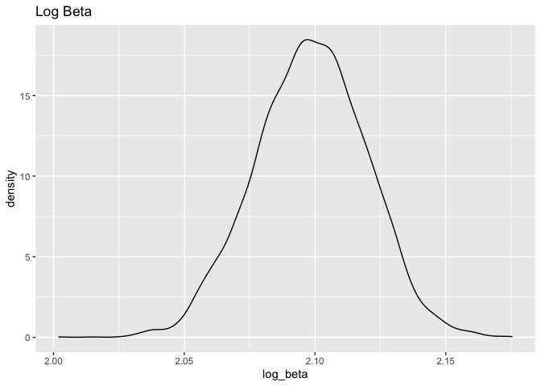
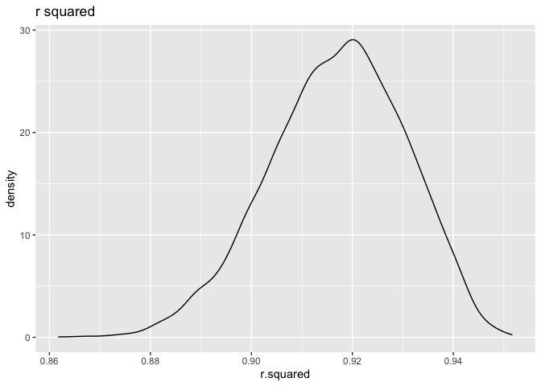
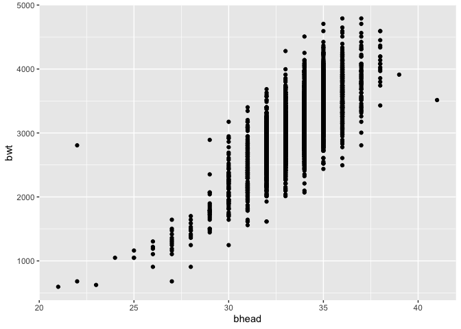
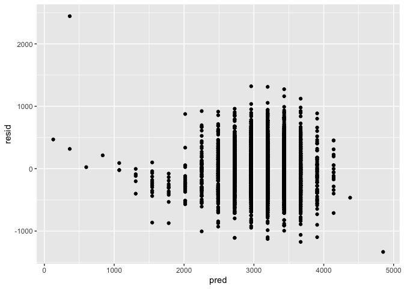
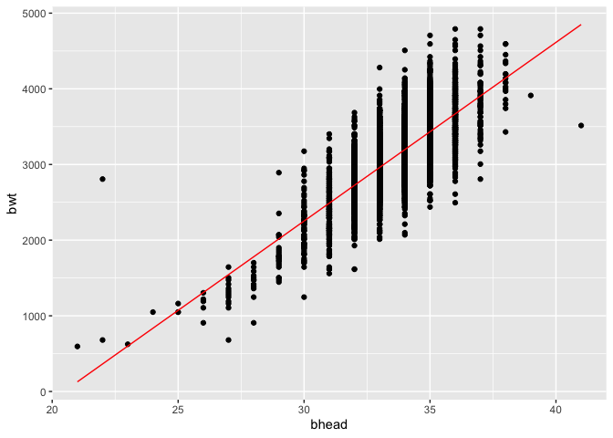
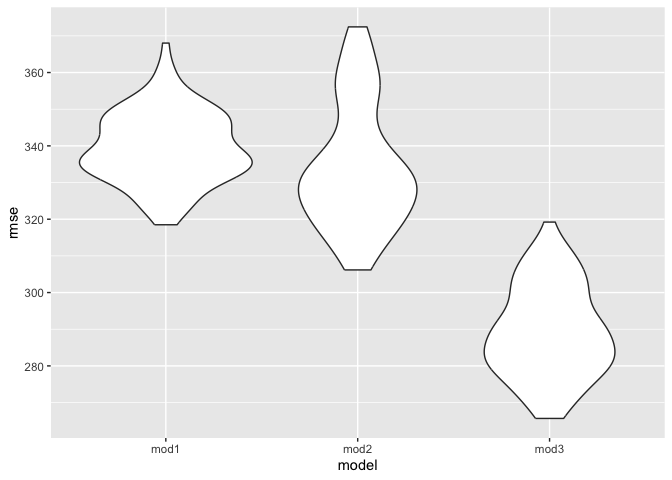

Homework 6
================
Wenxin Tian
2023-11-19

``` r
library(tidyverse)
```

    ## ── Attaching core tidyverse packages ──────────────────────── tidyverse 2.0.0 ──
    ## ✔ dplyr     1.1.3     ✔ readr     2.1.4
    ## ✔ forcats   1.0.0     ✔ stringr   1.5.0
    ## ✔ ggplot2   3.4.3     ✔ tibble    3.2.1
    ## ✔ lubridate 1.9.2     ✔ tidyr     1.3.0
    ## ✔ purrr     1.0.2     
    ## ── Conflicts ────────────────────────────────────────── tidyverse_conflicts() ──
    ## ✖ dplyr::filter() masks stats::filter()
    ## ✖ dplyr::lag()    masks stats::lag()
    ## ℹ Use the conflicted package (<http://conflicted.r-lib.org/>) to force all conflicts to become errors

``` r
library(modelr)
```

## Problem 1:

**Data Import:**

``` r
homicide =
  read_csv("./data/homicide-data.csv") |>
  mutate(
    city_state = paste(city, state, sep = ", "),
    resolved = as.numeric(disposition == "Closed by arrest")
  ) |>
  filter(
    !city_state %in% c("Dallas, TX", "Phoenix, AZ", "Kansas City, MO", "Tulsa, AL"),
    victim_race %in% c("White", "Black")
  ) |>
  mutate(victim_age = as.numeric(victim_age)) |>
  drop_na(victim_age) |>
  select(resolved, victim_age, victim_race, victim_sex, city_state)
```

    ## Rows: 52179 Columns: 12
    ## ── Column specification ────────────────────────────────────────────────────────
    ## Delimiter: ","
    ## chr (9): uid, victim_last, victim_first, victim_race, victim_age, victim_sex...
    ## dbl (3): reported_date, lat, lon
    ## 
    ## ℹ Use `spec()` to retrieve the full column specification for this data.
    ## ℹ Specify the column types or set `show_col_types = FALSE` to quiet this message.

    ## Warning: There was 1 warning in `mutate()`.
    ## ℹ In argument: `victim_age = as.numeric(victim_age)`.
    ## Caused by warning:
    ## ! NAs introduced by coercion

**GLM:**

``` r
baltimore = homicide |>
  filter(city_state == "Baltimore, MD")

baltimore_glm = 
  baltimore |>
  glm(resolved ~ victim_age + victim_race + victim_sex, data = _, family = binomial())


# Confidence interval??

baltimore_glm |>
  broom::tidy() |> 
  mutate(OR = exp(estimate)) |>
  select(term, log_OR = estimate, OR, p.value) |> 
  knitr::kable(digits = 3)
```

| term             | log_OR |    OR | p.value |
|:-----------------|-------:|------:|--------:|
| (Intercept)      |  0.310 | 1.363 |   0.070 |
| victim_age       | -0.007 | 0.993 |   0.043 |
| victim_raceWhite |  0.842 | 2.320 |   0.000 |
| victim_sexMale   | -0.854 | 0.426 |   0.000 |

``` r
baltimore |>
  add_predictions(baltimore_glm) |>
  mutate(prob = boot::inv.logit(pred))
```

    ## # A tibble: 2,753 × 7
    ##    resolved victim_age victim_race victim_sex city_state       pred  prob
    ##       <dbl>      <dbl> <chr>       <chr>      <chr>           <dbl> <dbl>
    ##  1        0         17 Black       Male       Baltimore, MD -0.659  0.341
    ##  2        0         26 Black       Male       Baltimore, MD -0.719  0.328
    ##  3        0         21 Black       Male       Baltimore, MD -0.686  0.335
    ##  4        1         61 White       Male       Baltimore, MD -0.113  0.472
    ##  5        1         46 Black       Male       Baltimore, MD -0.854  0.299
    ##  6        1         27 Black       Male       Baltimore, MD -0.726  0.326
    ##  7        1         21 Black       Male       Baltimore, MD -0.686  0.335
    ##  8        1         16 Black       Male       Baltimore, MD -0.652  0.343
    ##  9        1         21 Black       Male       Baltimore, MD -0.686  0.335
    ## 10        1         44 Black       Female     Baltimore, MD  0.0140 0.503
    ## # ℹ 2,743 more rows

## Problem 2:

**Data Import:**

``` r
weather_df = 
  rnoaa::meteo_pull_monitors(
    c("USW00094728"),
    var = c("PRCP", "TMIN", "TMAX"), 
    date_min = "2022-01-01",
    date_max = "2022-12-31") |>
  mutate(
    name = recode(id, USW00094728 = "CentralPark_NY"),
    tmin = tmin / 10,
    tmax = tmax / 10) |>
  select(name, id, everything())
```

    ## using cached file: /Users/will/Library/Caches/org.R-project.R/R/rnoaa/noaa_ghcnd/USW00094728.dly

    ## date created (size, mb): 2023-09-28 11:39:13.278523 (8.524)

    ## file min/max dates: 1869-01-01 / 2023-09-30

**Bootstrapping:**

``` r
bootstraps =
  weather_df |>
  bootstrap(5000) 

# r2:
r2 =
  bootstraps |>
  mutate(
    models = map(strap, \(df) lm(tmax ~ tmin + prcp, data = df) ),
    results = map(models, broom::glance)) |> 
  select(-strap, -models) |> 
  unnest(results)

# log beta:

log_beta =
  bootstraps |>
  mutate(
    models = map(strap, \(df) lm(tmax ~ tmin + prcp, data = df) ),
    results = map(models, broom::tidy)) |> 
  select(-strap, -models) |> 
  unnest(results)
```

**Plot:**

``` r
# Note: negative log transformation?

# intercept: beta0, tmin: beta1, prcp: beta3
log_beta |>
  pivot_wider(names_from = term, values_from = estimate) |>
  group_by(.id) |>
  mutate(intercept = `(Intercept)`) |>
  fill(intercept, tmin, prcp, .direction = 'up') |>
  fill(intercept, tmin, .direction = 'down') |>
  summarize(log_beta = log(intercept * tmin)) |>
  distinct() |>
  ggplot(aes(x = log_beta)) +
  geom_density() +
  labs(title = "Log Beta")
```

    ## Warning: Returning more (or less) than 1 row per `summarise()` group was deprecated in
    ## dplyr 1.1.0.
    ## ℹ Please use `reframe()` instead.
    ## ℹ When switching from `summarise()` to `reframe()`, remember that `reframe()`
    ##   always returns an ungrouped data frame and adjust accordingly.
    ## Call `lifecycle::last_lifecycle_warnings()` to see where this warning was
    ## generated.

    ## `summarise()` has grouped output by '.id'. You can override using the `.groups`
    ## argument.

<!-- -->

``` r
r2 |>
  ggplot(aes(x = r.squared)) +
  geom_density() +
  labs(title = "r squared")
```

<!-- -->

For both the r squared and log(beta0 \* beta1) estimates, a normal
distribution was seen. The log beta distribution is centered around
2.10, whereas the r2 distribution is centered around 0.91, which
indicates a strong correlation between predictor and outcome. One thing
to note is that the product of beta 1 and beta 2 are often negative and
cannot be log transformed, so I guess the question meant to ask
log(beta0 \* beta1), which is positive.

**Quantile:**

``` r
# Quantile for r2:
quantile(r2$r.squared, probs = c(0.025, 0.975))
```

    ##      2.5%     97.5% 
    ## 0.8890099 0.9407160

``` r
# Quantile for log beta:
logbeta_clean = 
  log_beta |>
  pivot_wider(names_from = term, values_from = estimate) |>
  group_by(.id) |>
  mutate(intercept = `(Intercept)`) |>
  fill(intercept, tmin, prcp, .direction = 'up') |>
  fill(intercept, tmin, .direction = 'down') |>
  summarize(log_beta = log(intercept * tmin)) |>
  distinct()
```

    ## Warning: Returning more (or less) than 1 row per `summarise()` group was deprecated in
    ## dplyr 1.1.0.
    ## ℹ Please use `reframe()` instead.
    ## ℹ When switching from `summarise()` to `reframe()`, remember that `reframe()`
    ##   always returns an ungrouped data frame and adjust accordingly.
    ## Call `lifecycle::last_lifecycle_warnings()` to see where this warning was
    ## generated.

    ## `summarise()` has grouped output by '.id'. You can override using the `.groups`
    ## argument.

``` r
quantile(logbeta_clean$log_beta, probs = c(0.025, 0.975))
```

    ##     2.5%    97.5% 
    ## 2.054847 2.138765

## Problem 3:

**Data Import:**

``` r
bwt_df =
  read_csv("./data/birthweight.csv") |>
  mutate(
    mrace = case_match(
      mrace,
      1 ~ "White",
      2 ~ "Black",
      3 ~ "Asian",
      4 ~ "Puerto Rican",
      8 ~ "Other"
    ),
    mrace = as.factor(mrace),
    fincome = as.factor(fincome),
    #bhead = as.factor(bhead)
    #ppwt = as.factor(ppwt)
  )
```

    ## Rows: 4342 Columns: 20
    ## ── Column specification ────────────────────────────────────────────────────────
    ## Delimiter: ","
    ## dbl (20): babysex, bhead, blength, bwt, delwt, fincome, frace, gaweeks, malf...
    ## 
    ## ℹ Use `spec()` to retrieve the full column specification for this data.
    ## ℹ Specify the column types or set `show_col_types = FALSE` to quiet this message.

**Regression Proposal:**

I propose a multiple linear regression against baby’s head circumfrance
at birth for the fact that head makes up a considerable proportion of
the body weight. Another reason is that after plotting multiple
variables against `bwt`, none of them showed any linearity with bwt
except for `bhead`. I believe mother’s weight plays an important role in
the birthweight of babies, and mother’s weight should also be correlated
with family income.

``` r
bwt_df |>
  ggplot(aes(bhead, bwt)) +
  geom_point()
```

<!-- -->

``` r
mod1 = lm(bwt ~ bhead, data = bwt_df)
mod1 |> broom::tidy()
```

    ## # A tibble: 2 × 5
    ##   term        estimate std.error statistic p.value
    ##   <chr>          <dbl>     <dbl>     <dbl>   <dbl>
    ## 1 (Intercept)   -4831.    107.       -45.0       0
    ## 2 bhead           236.      3.19      74.0       0

``` r
mod1 |> broom::glance()
```

    ## # A tibble: 1 × 12
    ##   r.squared adj.r.squared sigma statistic p.value    df  logLik    AIC    BIC
    ##       <dbl>         <dbl> <dbl>     <dbl>   <dbl> <dbl>   <dbl>  <dbl>  <dbl>
    ## 1     0.558         0.558  340.     5483.       0     1 -31475. 62957. 62976.
    ## # ℹ 3 more variables: deviance <dbl>, df.residual <int>, nobs <int>

``` r
bwt_df |>
  add_predictions(mod1) |>
  add_residuals(mod1) |>
  ggplot(aes(x = pred, y = resid)) +
  geom_point()
```

<!-- -->

``` r
bwt_df |>
  add_predictions(mod1) |>
  ggplot(aes(x = bhead, y = bwt)) +
  geom_point() +
  geom_line(aes(y = pred), color = "red") 
```

<!-- -->

From the summary, we see a relatively strong correlation between `bhead`
and `bwt`, which is also shown in the plots.

**Cross Validation:**

``` r
mod2 = 
  lm(bwt ~ blength + gaweeks, data = bwt_df)
mod3 =
  lm(bwt ~ blength + bhead + babysex
     + blength * bhead 
     + blength * babysex 
     + bhead * babysex
     + blength * bhead * babysex,
     data = bwt_df)

cv_df = 
  crossv_mc(bwt_df, 100) 

cv_df =
  cv_df |> 
  mutate(
    train = map(train, as_tibble),
    test = map(test, as_tibble))

cv_df = 
  cv_df |> 
  mutate(
    mod1  = map(train, \(df) lm(bwt ~ bhead, data = df)),
    mod2  = map(train, \(df) lm(bwt ~ blength + gaweeks, data = df)),
    mod3  = map(train, \(df) lm(bwt ~ blength + bhead + babysex
                                + blength * bhead 
                                + blength * babysex 
                                + bhead * babysex
                                + blength * bhead * babysex,
                                data = df))) |> 
  mutate(
    rmse_mod1 = map2_dbl(mod1, test, \(mod, df) rmse(model = mod, data = df)),
    rmse_mod2 = map2_dbl(mod2, test, \(mod, df) rmse(model = mod, data = df)),
    rmse_mod3 = map2_dbl(mod3, test, \(mod, df) rmse(model = mod, data = df)))

cv_df |> 
  select(starts_with("rmse")) |> 
  pivot_longer(
    everything(),
    names_to = "model", 
    values_to = "rmse",
    names_prefix = "rmse_") |> 
  mutate(model = fct_inorder(model)) |> 
  ggplot(aes(x = model, y = rmse)) + geom_violin()
```

<!-- -->

From the plot, we wee that the model that I proposed has a high
prediction error, whereas the the most complex model proposed on the
assignment has the lowest.

``` r
#scratchpaper

dbinom(1, 10, 0.75) * dpois(1, 2) + dbinom(2, 10, .75) * dpois(0, 2) + dbinom(0, 10, .75) * dpois(2, 2)
```

    ## [1] 6.027372e-05

``` r
exp(-2) + 1 / 4^10 - exp(-2) / 4^10
```

    ## [1] 0.1353361
