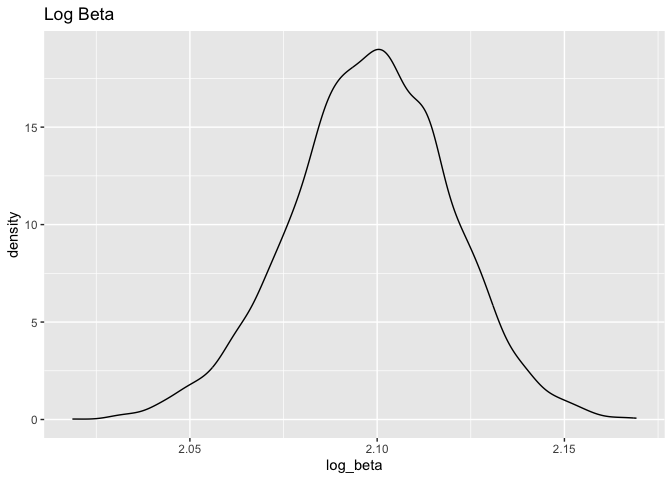

Homework 6
================
Wenxin Tian
2023-11-19

``` r
library(tidyverse)
```

    ## ── Attaching core tidyverse packages ──────────────────────── tidyverse 2.0.0 ──
    ## ✔ dplyr     1.1.3     ✔ readr     2.1.4
    ## ✔ forcats   1.0.0     ✔ stringr   1.5.0
    ## ✔ ggplot2   3.4.3     ✔ tibble    3.2.1
    ## ✔ lubridate 1.9.2     ✔ tidyr     1.3.0
    ## ✔ purrr     1.0.2     
    ## ── Conflicts ────────────────────────────────────────── tidyverse_conflicts() ──
    ## ✖ dplyr::filter() masks stats::filter()
    ## ✖ dplyr::lag()    masks stats::lag()
    ## ℹ Use the conflicted package (<http://conflicted.r-lib.org/>) to force all conflicts to become errors

``` r
library(modelr)
```

## Problem 1:

**Data Import:**

``` r
homicide =
  read_csv("./data/homicide-data.csv") |>
  mutate(
    city_state = paste(city, state, sep = ", "),
    resolved = as.numeric(disposition == "Closed by arrest")
  ) |>
  filter(
    !city_state %in% c("Dallas, TX", "Phoenix, AZ", "Kansas City, MO", "Tulsa, AL"),
    victim_race %in% c("White", "Black")
  ) |>
  mutate(victim_age = as.numeric(victim_age)) |>
  drop_na(victim_age) |>
  select(resolved, victim_age, victim_race, victim_sex, city_state)
```

    ## Rows: 52179 Columns: 12
    ## ── Column specification ────────────────────────────────────────────────────────
    ## Delimiter: ","
    ## chr (9): uid, victim_last, victim_first, victim_race, victim_age, victim_sex...
    ## dbl (3): reported_date, lat, lon
    ## 
    ## ℹ Use `spec()` to retrieve the full column specification for this data.
    ## ℹ Specify the column types or set `show_col_types = FALSE` to quiet this message.

    ## Warning: There was 1 warning in `mutate()`.
    ## ℹ In argument: `victim_age = as.numeric(victim_age)`.
    ## Caused by warning:
    ## ! NAs introduced by coercion

**GLM:**

``` r
baltimore = homicide |>
  filter(city_state == "Baltimore, MD")

baltimore_glm = 
  baltimore |>
  glm(resolved ~ victim_age + victim_race + victim_sex, data = _, family = binomial())


# Confidence interval??

baltimore_glm |>
  broom::tidy() |> 
  mutate(OR = exp(estimate)) |>
  select(term, log_OR = estimate, OR, p.value) |> 
  knitr::kable(digits = 3)
```

| term             | log_OR |    OR | p.value |
|:-----------------|-------:|------:|--------:|
| (Intercept)      |  0.310 | 1.363 |   0.070 |
| victim_age       | -0.007 | 0.993 |   0.043 |
| victim_raceWhite |  0.842 | 2.320 |   0.000 |
| victim_sexMale   | -0.854 | 0.426 |   0.000 |

``` r
baltimore |>
  add_predictions(baltimore_glm) |>
  mutate(prob = boot::inv.logit(pred))
```

    ## # A tibble: 2,753 × 7
    ##    resolved victim_age victim_race victim_sex city_state       pred  prob
    ##       <dbl>      <dbl> <chr>       <chr>      <chr>           <dbl> <dbl>
    ##  1        0         17 Black       Male       Baltimore, MD -0.659  0.341
    ##  2        0         26 Black       Male       Baltimore, MD -0.719  0.328
    ##  3        0         21 Black       Male       Baltimore, MD -0.686  0.335
    ##  4        1         61 White       Male       Baltimore, MD -0.113  0.472
    ##  5        1         46 Black       Male       Baltimore, MD -0.854  0.299
    ##  6        1         27 Black       Male       Baltimore, MD -0.726  0.326
    ##  7        1         21 Black       Male       Baltimore, MD -0.686  0.335
    ##  8        1         16 Black       Male       Baltimore, MD -0.652  0.343
    ##  9        1         21 Black       Male       Baltimore, MD -0.686  0.335
    ## 10        1         44 Black       Female     Baltimore, MD  0.0140 0.503
    ## # ℹ 2,743 more rows

## Problem 2:

**Data Import:**

``` r
weather_df = 
  rnoaa::meteo_pull_monitors(
    c("USW00094728"),
    var = c("PRCP", "TMIN", "TMAX"), 
    date_min = "2022-01-01",
    date_max = "2022-12-31") |>
  mutate(
    name = recode(id, USW00094728 = "CentralPark_NY"),
    tmin = tmin / 10,
    tmax = tmax / 10) |>
  select(name, id, everything())
```

    ## using cached file: /Users/will/Library/Caches/org.R-project.R/R/rnoaa/noaa_ghcnd/USW00094728.dly

    ## date created (size, mb): 2023-09-28 11:39:13.278523 (8.524)

    ## file min/max dates: 1869-01-01 / 2023-09-30

**Bootstrapping:**

``` r
bootstraps =
  weather_df |>
  bootstrap(5000) 

# r2:
r2 =
  bootstraps |>
  mutate(
    models = map(strap, \(df) lm(tmax ~ tmin + prcp, data = df) ),
    results = map(models, broom::glance)) |> 
  select(-strap, -models) |> 
  unnest(results)

# log beta:

log_beta =
  bootstraps |>
  mutate(
    models = map(strap, \(df) lm(tmax ~ tmin + prcp, data = df) ),
    results = map(models, broom::tidy)) |> 
  select(-strap, -models) |> 
  unnest(results)
```

**Plot:**

``` r
# Note: negative log transformation?

# intercept: beta0, tmin: beta1, prcp: beta3
log_beta |>
  pivot_wider(names_from = term, values_from = estimate) |>
  group_by(.id) |>
  mutate(intercept = `(Intercept)`) |>
  fill(intercept, tmin, prcp, .direction = 'up') |>
  fill(intercept, tmin, .direction = 'down') |>
  summarize(log_beta = log(intercept * tmin)) |>
  distinct() |>
  ggplot(aes(x = log_beta)) +
  geom_density() +
  labs(title = "Log Beta")
```

    ## Warning: Returning more (or less) than 1 row per `summarise()` group was deprecated in
    ## dplyr 1.1.0.
    ## ℹ Please use `reframe()` instead.
    ## ℹ When switching from `summarise()` to `reframe()`, remember that `reframe()`
    ##   always returns an ungrouped data frame and adjust accordingly.
    ## Call `lifecycle::last_lifecycle_warnings()` to see where this warning was
    ## generated.

    ## `summarise()` has grouped output by '.id'. You can override using the `.groups`
    ## argument.

<!-- -->

``` r
r2 |>
  ggplot(aes(x = r.squared)) +
  geom_density() +
  labs(title = "r squared")
```

<!-- -->

For both the r squared and log(beta0 \* beta1) estimates, a normal
distribution was seen. The log beta distribution is centered around
2.10, whereas the r2 distribution is centered around 0.91, which
indicates a strong correlation between predictor and outcome. One thing
to note is that the product of beta 1 and beta 2 are often negative and
cannot be log transformed, so I guess the question meant to ask
log(beta0 \* beta1), which is positive.

**Quantile:**

``` r
# Quantile for r2:
quantile(r2$r.squared, probs = c(0.025, 0.975))
```

    ##      2.5%     97.5% 
    ## 0.8890568 0.9408225

``` r
# Quantile for log beta:
logbeta_clean = 
  log_beta |>
  pivot_wider(names_from = term, values_from = estimate) |>
  group_by(.id) |>
  mutate(intercept = `(Intercept)`) |>
  fill(intercept, tmin, prcp, .direction = 'up') |>
  fill(intercept, tmin, .direction = 'down') |>
  summarize(log_beta = log(intercept * tmin)) |>
  distinct()
```

    ## Warning: Returning more (or less) than 1 row per `summarise()` group was deprecated in
    ## dplyr 1.1.0.
    ## ℹ Please use `reframe()` instead.
    ## ℹ When switching from `summarise()` to `reframe()`, remember that `reframe()`
    ##   always returns an ungrouped data frame and adjust accordingly.
    ## Call `lifecycle::last_lifecycle_warnings()` to see where this warning was
    ## generated.

    ## `summarise()` has grouped output by '.id'. You can override using the `.groups`
    ## argument.

``` r
quantile(logbeta_clean$log_beta, probs = c(0.025, 0.975))
```

    ##     2.5%    97.5% 
    ## 2.056148 2.138473
